# Contexto de Design

Página explicativa do contexto, em concordância com a apresentação produzida em grupo. Componente de **grupo**.

## 1. Resumo / Abstract

### Resumo (PT)

A **NESTOR** nasce como uma proposta de design sustentável que une a fabricação digital, a pedagogia e a reutilização de materiais desperdiçados pelas indústrias de mobiliário. O projeto parte da ideia de que o desperdício industrial pode ser transformado em brinquedos com valor educativo e emocional, criando peças em madeira recuperada que estimulam a criatividade, a descoberta e o pensamento crítico. Através da integração do corte CNC, o sistema otimiza o uso da matéria-prima e reduz o impacto ambiental, convertendo excedentes da indústria do mobiliário em objetos duráveis e significativos.

Mais do que um conjunto de brinquedos, a NESTOR representa um sistema modular de aprendizagem. Cada peça é desenhada para ser explorada, desmontada e reconstruída, permitindo múltiplas combinações e interpretações. A precisão do corte CNC garante encaixes seguros e flexíveis, enquanto o uso de madeira recuperada traduz o compromisso da marca com uma produção responsável e sustentável.

O projeto organiza-se em duas linhas complementares: **NESTOR BUILDING**, dedicada à construção e experimentação espacial, estimula a coordenação motora, a persistência e o raciocínio lógico através de desafios progressivos de montagem; e **NESTOR VERSUS**, centrada na interação social e na competição saudável, promove empatia, estratégia e cooperação através do jogo partilhado. Ambas partilham uma linguagem visual coerente e uma abordagem pedagógica que valoriza o brincar como forma de aprender.

Formalmente, o design dos brinquedos inspira-se na tradição dos brinquedos em madeira, dos sistemas modulares de Leonardo da Vinci aos puzzles japoneses Kumiki, reinterpretando esses princípios com tecnologia contemporânea. A estética cuidada e o contraste entre madeiras claras e escuras, como pinho e cerejeira, conferem identidade à marca, transmitindo equilíbrio entre simplicidade e engenho construtivo.

A **NESTOR** propõe, assim, uma reflexão sobre o papel do design na educação e na sustentabilidade. Ao transformar desperdício em objetos de descoberta, o projeto demonstra como o design pode ser simultaneamente funcional, pedagógico e ecológico, convidando crianças e adultos a redescobrir o valor do brincar e da matéria natural. Além disso, a marca NESTOR transmite a sua estética e valores através da identidade gráfica e de todos os elementos que a compõem, garantindo coerência entre o produto físico e a comunicação visual, uma expressão que integra os princípios de sustentabilidade, clareza e aprendizagem que definem o projeto.

### Abstract (EN)

**NESTOR** is born as a sustainable design proposal that brings together digital fabrication, pedagogy, and the reuse of materials wasted by the furniture industry. The project starts from the idea that industrial waste can be transformed into toys with educational and emotional value, creating pieces in reclaimed wood that stimulate creativity, discovery, and critical thinking. Through the integration of CNC cutting, the system optimizes the use of raw material and reduces environmental impact, converting furniture-industry surpluses into durable and meaningful objects.

More than a set of toys, NESTOR represents a modular learning system. Each piece is designed to be explored, disassembled, and reassembled, allowing multiple combinations and interpretations. The precision of CNC cutting ensures secure and flexible joints, while the use of reclaimed wood reflects the brand’s commitment to responsible and sustainable production.

The project is organized into two complementary lines: **NESTOR BUILDING**, dedicated to construction and spatial experimentation, which stimulates motor coordination, persistence, and logical reasoning through progressively challenging assembly tasks; and **NESTOR VERSUS**, focused on social interaction and healthy competition, which promotes empathy, strategy, and cooperation through shared play. Both lines share a coherent visual language and a pedagogical approach that values play as a form of learning.

Formally, the toy designs draw on the tradition of wooden toys, from Leonardo da Vinci’s modular systems to Japanese Kumiki puzzles, reinterpreting these principles with contemporary technology. The careful aesthetic and the contrast between light and dark woods, such as **pine and cherry**, give the brand its identity, conveying a balance between simplicity and constructive ingenuity.

**NESTOR** thus proposes a reflection on the role of design in education and sustainability. By transforming waste into objects of discovery, the project demonstrates how design can be simultaneously functional, pedagogical, and ecological, inviting children and adults to rediscover the value of play and natural materials. Furthermore, the NESTOR brand conveys its aesthetic and values through its visual identity and all its constituent elements, ensuring coherence between the physical product and visual communication, an integrated expression of the project’s principles of sustainability, clarity, and learning.

## 2. Referências Coletivas

### 2.1. Recolha de Objetos a Redesenhar/Remisturar

Catálogo de objetos de partida que o grupo identificou para o redesenho. Para cada objeto: imagem, origem, motivo da escolha.

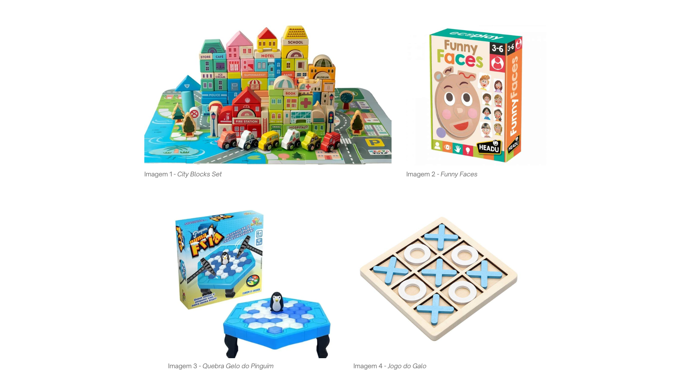

- **Objeto 1** — Conjunto de Blocos de Madeira de Construção (imagem 1) / *Wooden City Building Blocks Set - NESTA TOYS* / Inspirado nas minhas brincadeiras de infância com blocos de construção e criação de "cidades". O objetivo foi reinterpretar esse tipo de brinquedo, acrescentando propósito, progressão, desafios que ampliam a experiência original e interesse contínuo, criando assim o brinquedo Skyvila.  
- **Objeto 2** — Brinquedo das Personagens (imagem 2) / *Funny Faces, Headu* / O brinquedo *Funny Faces* foi escolhido como principal referência para o brinquedo BUDDYUP por utilizar um sistema simples de montagem e combinação de peças que permite criar diferentes personagens e expressões faciais. A sua abordagem baseada na experimentação, criatividade e interação livre demonstrou como formas simples podem gerar múltiplas possibilidades de jogo, tornando-se simultaneamente educativo e divertido para a criança. Esta referência inspirou o desenvolvimento do meu projeto ao nível da modularidade e da construção de personagens através de encaixes. No entanto, o conceito foi adaptado ao universo NESTOR BUILDING, substituindo o foco nas expressões faciais por figuras completas compostas por cabeça, tronco e pernas, permitindo criar diferentes habitantes para a cidade e reforçando a ligação ao projeto coletivo.
- **Objeto 3** — Quebra gelo do Pinguim (imagem 3) / *Pinguim Numa Fria, Art Brink* / Em criança, sempre gostei de brinquedos que envolviam equilíbrio, precisão e algum nível de desafio. Ao inspirar-me no *Pinguim Numa Fria*, quis reinterpretar essa experiência e transformá-la em algo mais versátil e interativo. Mantive a tensão de retirar peças sem comprometer a estrutura, mas acrescentei uma componente mais estratégica através de blocos numerados e da construção em forma de fortaleza. Além disso, a possibilidade de empilhar, reorganizar e reconstruir as peças amplia as formas de brincar, estimulando a criatividade, a coordenação motora e a interação entre os jogadores.
- **Objeto 4** — Jogo do Galo (imagem 4) / *Jogo do Galo, Jogo do galo tradicional em madeira* / Ao criar o Tritower, procurei desenvolver um brinquedo que combinasse diversão, estratégia e interação. A ideia surgiu da vontade de reinventar um jogo clássico conhecido por todos, dando-lhe uma nova abordagem através de uma estrutura tridimensional que torna cada jogada mais desafiante. O conceito baseia-se na formação de uma linha de três peças iguais, mas, ao contrário da versão tradicional, o jogo acontece na vertical, criando novas possibilidades e exigindo uma maior capacidade de observação e planeamento. Esta alteração simples transforma a dinâmica do jogo e torna cada partida mais imprevisível.
  Para além do entretenimento, o Tritower estimula competências como o pensamento estratégico, a resolução de problemas e a tomada de decisões. Ao mesmo tempo, promove a partilha de momentos entre jogadores, incentivando a comunicação, a competição saudável e a aprendizagem através da brincadeira.

### 2.2. Moodboard

Painel de referências visuais e conceptuais que orientam a estratégia do grupo.

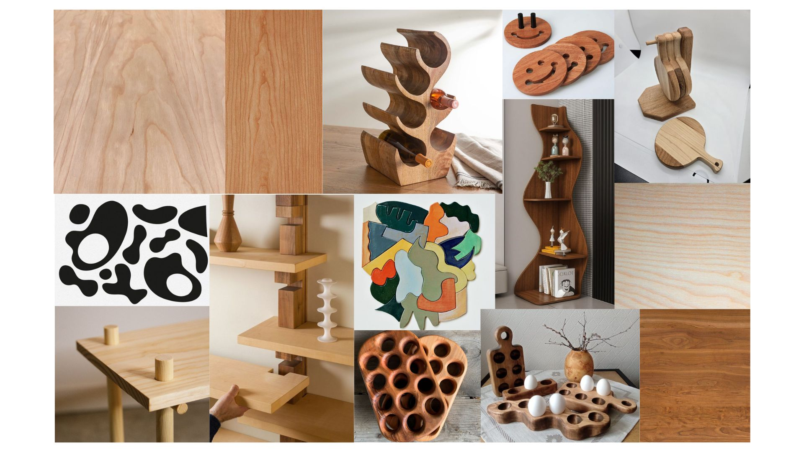
Moodboard de referências

O moodboard foi essencial para a direção dos nossos brinquedos e serviu como ponto de partida para o processo criativo de cada peça, orientando formas, encaixes e escolha de material. A partir das referências selecionadas definimos linhas curvas, tipos de junta e paleta de madeiras (pinho e cerejeira), privilegiando o contraste entre tons claros e tons mais escuros. Serviu assim para consolidar critérios comuns de grupo e orientou o desenvolvimento de cada brinquedo. 

## 3. Embalagem

### 3.1. Conceito e Materialidade

A conceção da embalagem partiu dos princípios da sustentabilidade, do detalhe e do impacto gráfico, prócuramos materiais e soluções que comuniquem os valores da marca **NESTOR** e que ao mesmo tempo chamem a atenção das crianças e dos compradores (pais). 
Optámos por cartão reciclado de alta gramagem, impressão de baixo impacto e acabamentos que valorizem a textura natural, garantindo presença visual sem desperdício. 

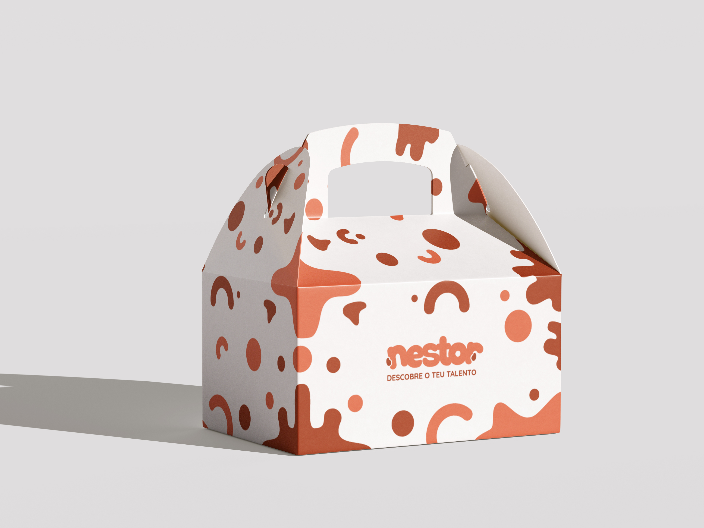
Mockup da embalagem principal - vista lateral

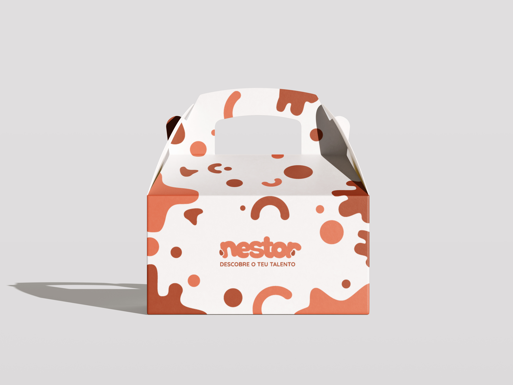
Mockup da embalagem principal - vista frontal 

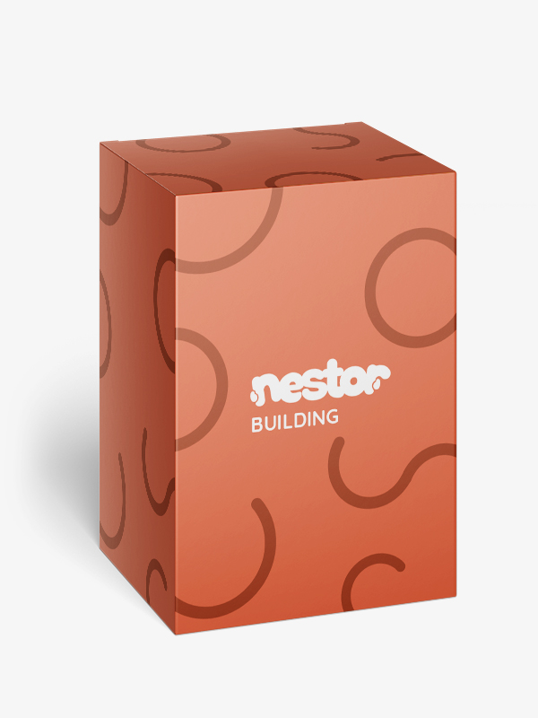
Mockup da embalagem secundária - NESTOR BUILDING

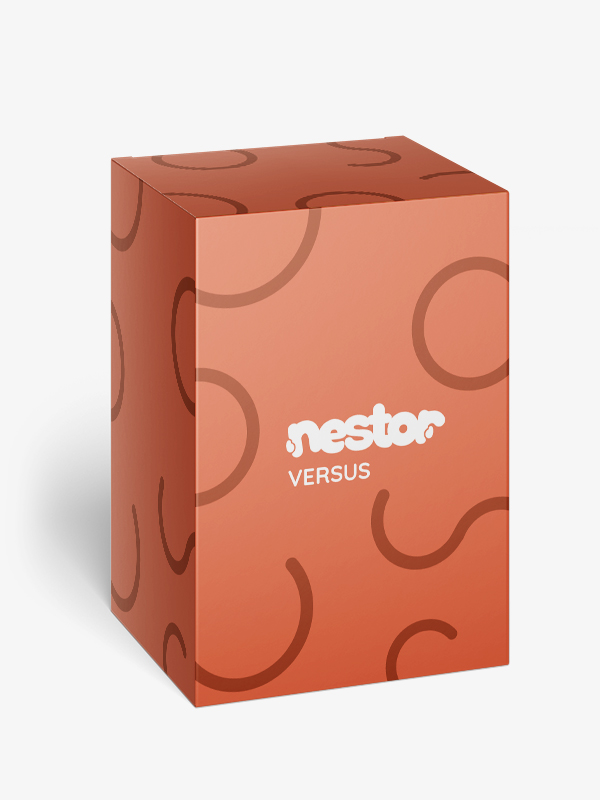
Mockup da embalagem secundária - NESTOR VERSUS

Foi então pensada numa estrutura constituída por uma caixa principal, capaz de acomodar até quatro brinquedos de uma só vez, complementada por embalagens secundárias identificadas por cada submarca (**NESTOR BUILDING, NESTOR VERSUS**). Estas embalagens secundárias funcionam como organizadores modulares que facilitam a identificação da linha a que cada produto pertence, organizam os brinquedos dentro da caixa principal e podem ser utilizadas como embalagens individuais caso o brinquedo seja compardo separadamente. 

O design privilegiou também a portalidade e a reutilização, a caixa principal inclui uma alça ergonómica para facilitar o transporte pela criança, e a construção permite múltiplos usos ao longo do tempo. 

### 3.2. Cortante

Aqui encontra-se o cortante da embalagem. O layout foi desenhado para garantir continuidade gráfica quando a caixa está totalmente fechada. O padrão ilustrativo desenvolvido foi pensado como extensão da identidade visual da marca. 

Cortante - embalagem principal

### 3.2. Prototipo Impresso e Caixa Montada

Foi impresso um protótipo para validar medidas, proporções e a leitura tátil dos acabamentos. Estas impressões serviram para ajustar encaixes, testar a ergonomia da alça e confirmar a escala das inserções internas. Trata‑se de um protótipo funcional, ainda não são as medidas finais de produção, mas permitiram validar decisões. 

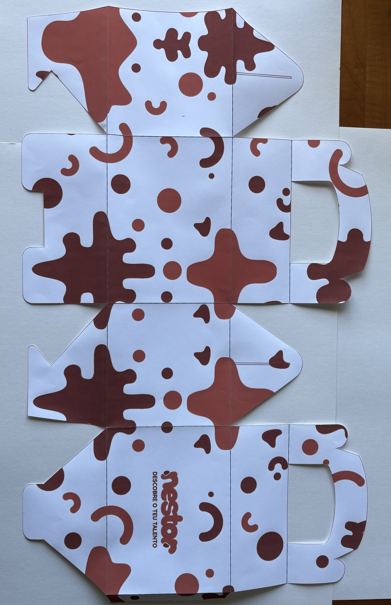
Embalagem totalmente aberta

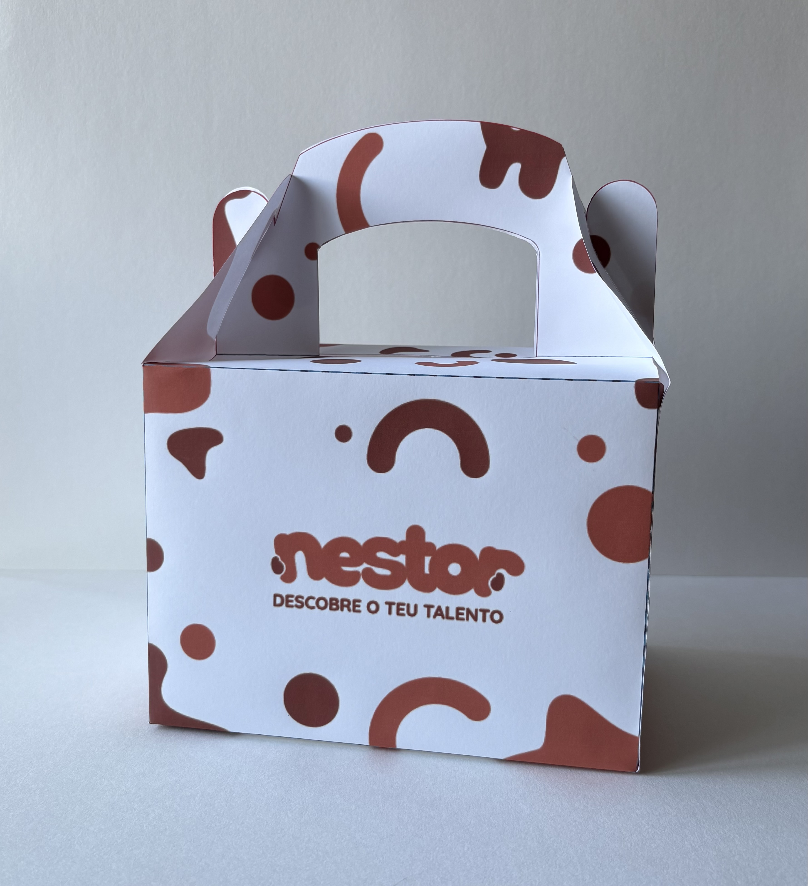
Embalagem montada - vista frontal

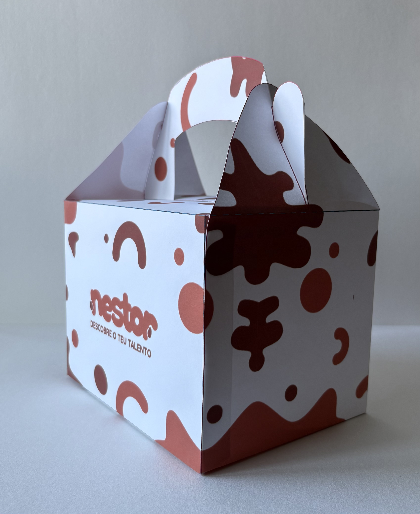
Embalagem montada - vista lateral

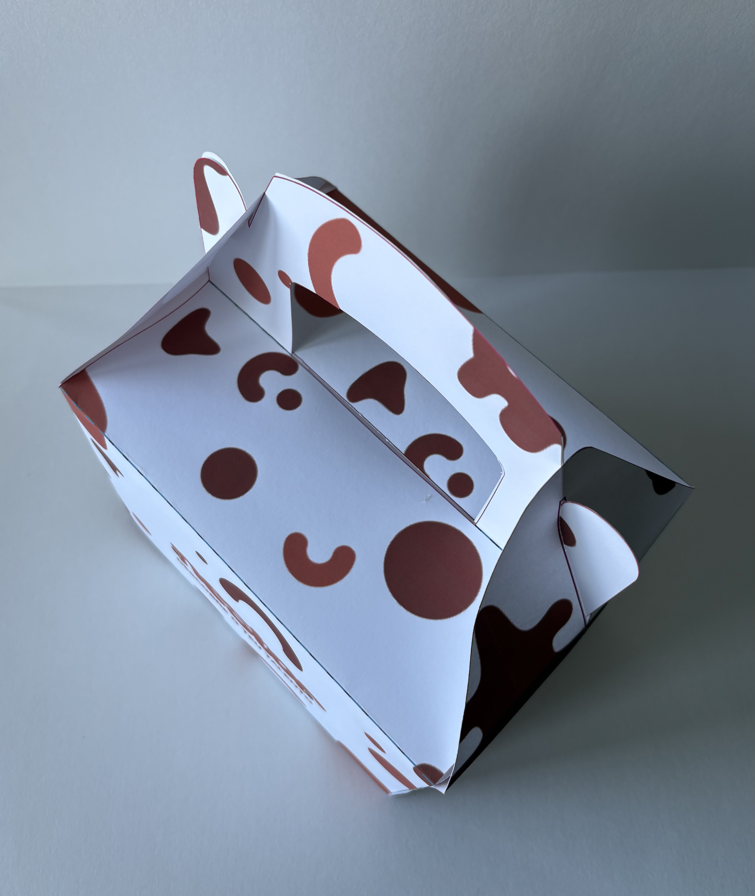
Embalagem montada - vista de cima

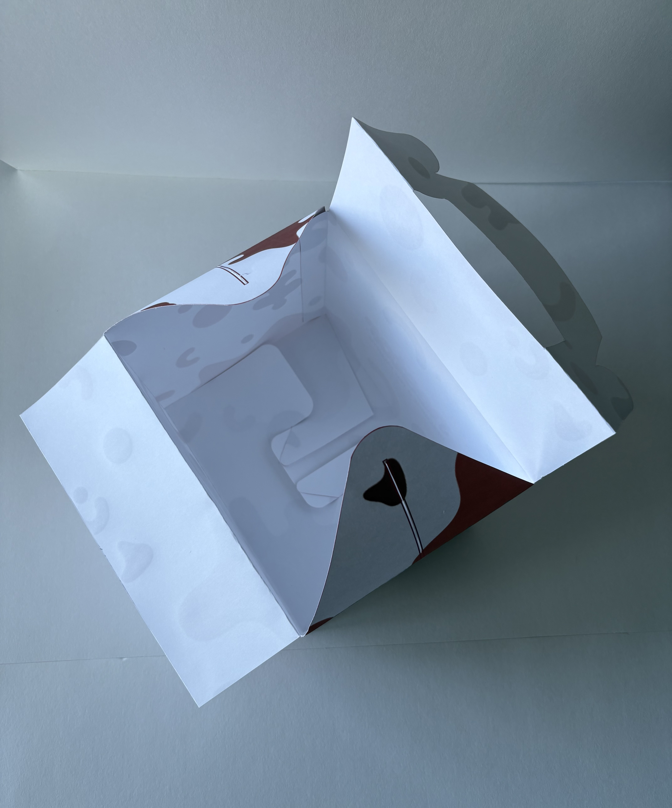
Emabalgem aberta - vista de cima

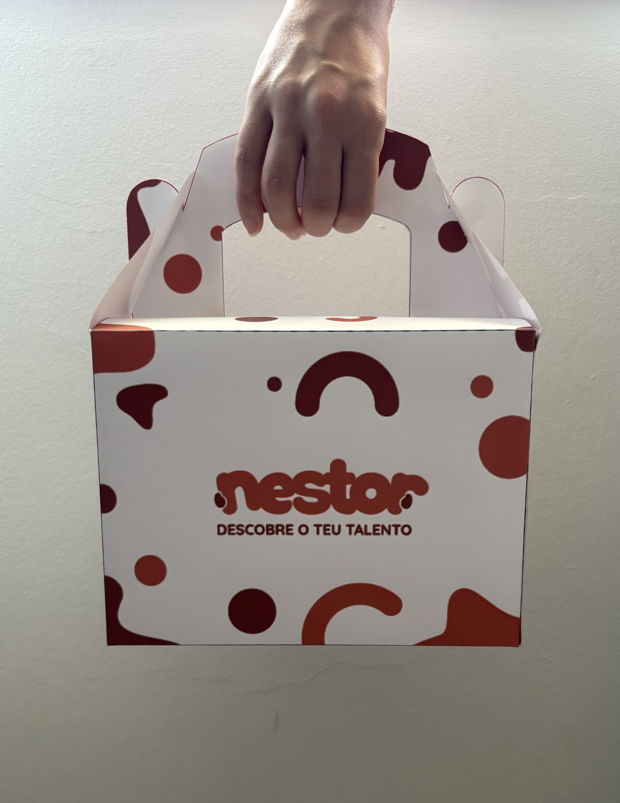
Embalagem montada - exemplo de utilização