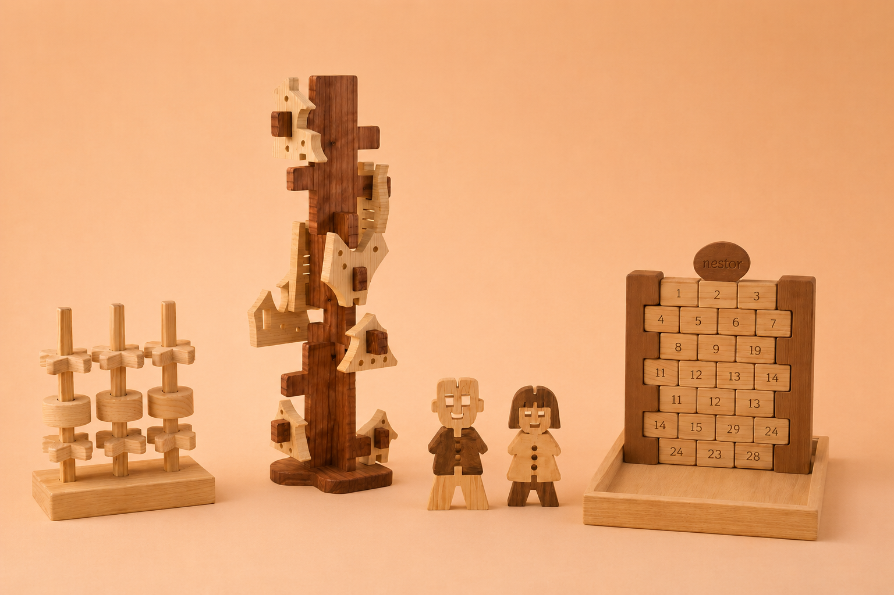
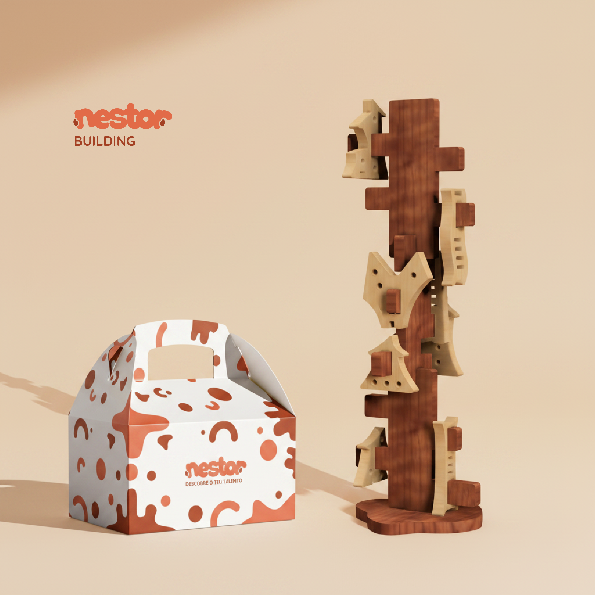
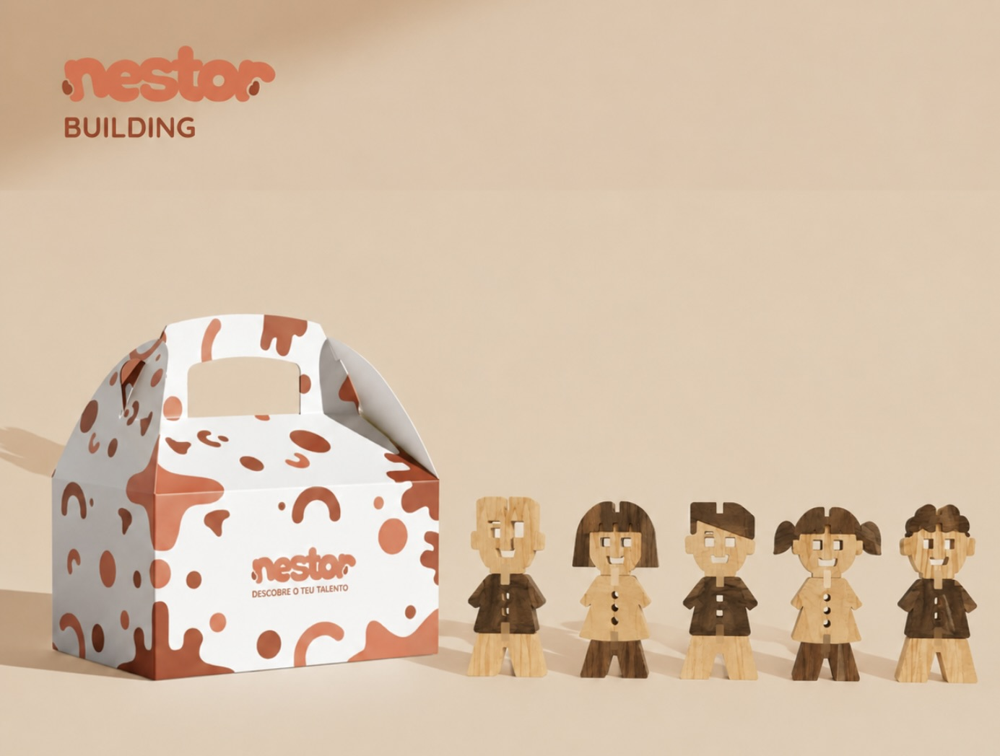

**
# Descobre o teu Talento

> Transformamos madeira recuperada em experiências de criatividade e descoberta.

## Elementos do Grupo

| Número  | Nome             |
| ------- | ---------------- |
| 2024284 | Adaíse Neto      |
| 2024315 | Adriana Graveiro |
| 2024339 | Ana Brügger      |
| 2024324 | Tânia Nunes      |

---

## Contexto de Design

Imagem gerada por inteligência artificial que reúne os quatro brinquedos do projeto

A **Nestor** é uma marca dedicada à criação de brinquedos em **madeira recuperada** que promovem sustentabilidade, durabilidade e experiências de brincar com significado. O principal objetivo é tranformar madeira desperdiçada em objetos que estimulem a criatividade, a descoberta e o desenvolvimento cognitivo, oferecendo produtos com design cuidado, segurança e elevado valor pedagógico. 

A Nestor organiza os seus produtos em duas linhas complementares: **NESTOR BUILDING** e **NESTOR VERSUS**, criadas para responder a diferentes modos de brincar e necessidades de desenvolvimento dentro da faixa etária alvo. A distinção entre linhas permite articular vertentes distintas da experiência lúdica, garantindo coerência pedagógica e diversidade de estímulos. 
**NESTOR BUILDING**: O que é: linha de brinquedos de construção, de empilhamento e encaixe que propõe desafios progressivos de montagem. 
Caracteristicas: peças modelares e empilháveis, níveis de dificuldade escalonados; foco na exploração espacial e experimentação de opções. Os conjuntos podem ser combinados entre si, criando um universo aberto que permite às crianças ampliar e personalizar o seu "mundo". 
Objetivos pedagógicos: desenvolver noções espaciais, coordenação motora fina, resolução de problemas e persistência.
**NESTOR VERSUS**: O que é: linha orientada para o jogo social e competição saudável, centrada na interação, na narrativa e na resolução de conflitos lúdicos. 
Características: conjuntos pensados para partidas curtas ou cooperativas; regras simples e adaptáveis; peças que favorecem estratégia e storytelling.
Objetivos pedagógicos: promover competências sociais, tomada de decisão, pensamento estratégico e empatia através do jogo partilhado.  

Ambas as linhas partilham valores comuns: madeira recuperada, design pensado ao detalhe e foco nas experiências que promovem criatividade e descoberta. Em conjunto, **NESTOR BUILDING** e **NESTOR VERSUS** compõem um portfólio coerente que responde a diferentes formas de brincar e aprender ao longo do crescimento infantil, oferecendo soluções tanto para o jogo autónomo como para a interação social.

Resumo, referências coletivas e moodboard do grupo encontram-se em [contexto.md](contexto.md).

[Ver contexto completo →](contexto.md)

---
## Galeria de Produtos

<!-- Cada thumbnail liga à página individual de cada produto.
     Cada produto vive em produtos/<numero>-<nome>/index.md
     e tem uma sub-página produtos/<numero>-<nome>/processo.md -->

<!-- markdownlint-disable MD033 -->

  <!-- duplicar o bloco abaixo para cada produto do grupo -->

  <a class="gallery-card" href="produtos/Skyvila/">
    
    <h3>Skyvila</h3>
    
Tânia Nunes

  </a>
<a class="gallery-card" href="produtos/BuddyUp/">
    
    <h3>BuddyUp</h3>
    
Adriana Graveiro

  </a>
  <a class="gallery-card" href="produtos/Blokar/">
    
    <h3>Blokar</h3>
    
Ana Brügger

  </a>
  <a class="gallery-card" href="produtos/TriTower/">
    
    <h3>TriTower</h3>
    
Adaíse Neto

  </a>
  <!-- duplicar o bloco acima para cada produto do grupo  e substituir _modelo em ambas por <numero>-<nome> -->

