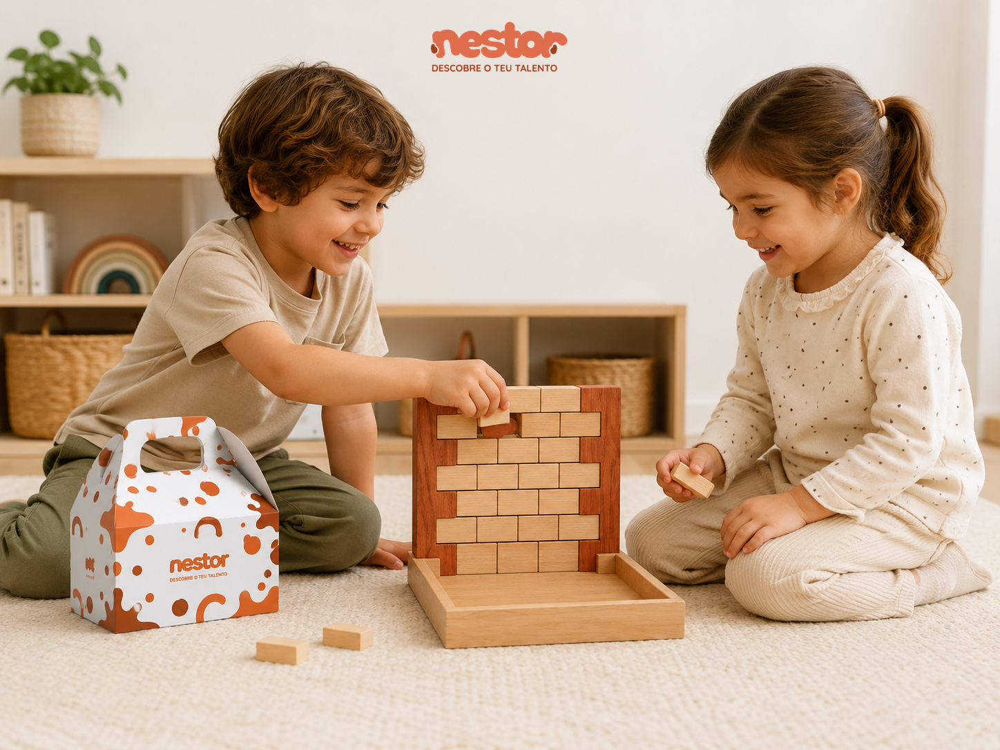
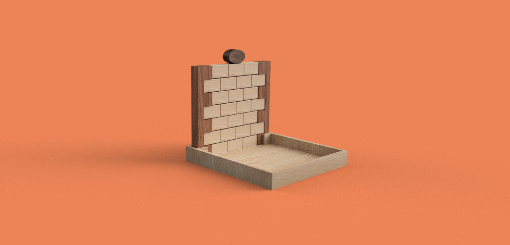

# Blokar

<!--
  HERO: idealmente uma pseudo-sessão fotográfica do produto
  (ver tutorial Pletor.ai nos Recursos da disciplina, em
  /Recursos/AI_exps/). Usa attachments/hero.jpg para o frontmatter.
-->

> Estratégia, precisão e diversão em equilíbrio. 

## Conceito

O produto faz parte da linha **VERSUS** e consiste num jogo competitivo destinado a crianças dos **6 aos 12 anos**, desenvolvido com o objetivo de estimular a coordenação motora, a concentração, o raciocínio estratégico e a interação social. Inspirado nos tradicionais jogos de remoção de blocos, o desafio consiste em retirar peças numeradas de uma estrutura sem provocar a queda dos restantes elementos.

À medida que o jogo avança, a estrutura torna-se cada vez mais instável, exigindo maior precisão, capacidade de observação e tomada de decisão por parte dos jogadores. O brinquedo promove o desenvolvimento de competências cognitivas e motoras através da experimentação, da gestão do risco e da resolução de problemas, proporcionando uma experiência divertida e desafiante.

## Enquadramento

O desenvolvimento do Blokar surge da exploração de brinquedos e jogos que incentivam a participação ativa dos utilizadores através do desafio, da estratégia e da destreza manual. Ao longo da fase de pesquisa foram analisadas diferentes tipologias de jogos de equilíbrio, permitindo identificar aspetos relevantes como a simplicidade das formas, a repetição de elementos e a criação de dinâmicas de interação entre jogadores.

Com base nessa análise, o projeto foi concebido de forma a integrar a identidade visual e os princípios definidos pelo grupo, privilegiando uma linguagem formal simples, o recurso à madeira e soluções construtivas adequadas ao fabrico digital. O resultado é um brinquedo que combina competição e aprendizagem, promovendo o desenvolvimento de competências motoras e cognitivas através de uma experiência lúdica e acessível.

## Tecnologia

Para a produção do Blokar foi utilizada madeira, um material que combina resistência, durabilidade e uma aparência natural, contribuindo para a coerência visual da marca. O fabrico das peças foi realizado através de corte CNC sobre uma placa com 42 mm de espessura, permitindo obter componentes precisos e consistentes.

A componente técnica do projeto foi desenvolvida no Autodesk Fusion 360. Neste software foram definidas as dimensões, geometrias e encaixes necessários ao funcionamento do brinquedo, bem como a organização das peças na placa de corte. Este processo permitiu otimizar a utilização do material disponível, reduzindo desperdícios e garantindo uma produção mais eficiente.

- Modelo 3D: [<!-- embed Fusion ou link a360.co -->](https://a360.co/44f22Ts)

## Função

**Como se brinca**

Os jogadores montam a estrutura inicial e alternam turnos, retirando uma das peças numeradas sem provocar a queda dos restantes elementos. À medida que o número de peças diminui, a estrutura torna-se mais instável, aumentando a dificuldade do jogo. Vence o jogador que conseguir realizar a última jogada válida antes do colapso da construção.

**Idade-alvo**

O brinquedo destina-se a crianças dos **6 aos 12 anos**, faixa etária em que já existe capacidade para compreender regras simples, desenvolver estratégias e executar movimentos com maior precisão e controlo.

**Montagem**

A montagem é simples e intuitiva, consistindo apenas no encaixe das peças que compõem a estrutura do jogo. O sistema foi desenvolvido para dispensar a utilização de ferramentas, permitindo uma preparação rápida antes da utilização e uma arrumação igualmente simples após a brincadeira.

**Conformidade com a Diretiva 2009/48/CE**

O brinquedo foi concebido de acordo com os princípios da Diretiva 2009/48/CE relativa à segurança dos brinquedos. A seleção de materiais adequados, a ausência de elementos cortantes e a robustez da estrutura contribuem para uma utilização segura por parte da faixa etária recomendada. Estas características permitem a sua utilização tanto em contexto doméstico como educativo.

## Apresentação

As imagens apresentadas procuram representar o produto final e os seus principais aspetos visuais. As duas primeiras foram geradas com recurso à inteligência artificial do *ChatGPT*, enquanto as restantes correspondem a renders obtidos a partir do modelo desenvolvido no *Autodesk Fusion 360*.

## Processo

O percurso completo de iterações, modelos e pesquisa está em [processo.md](processo.md), organizado do **mais recente** para o **mais antigo**.

[Ver processo completo →](processo.md)
