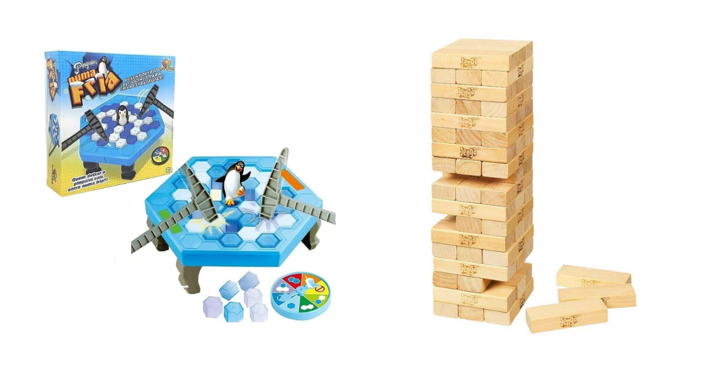

# Processo

> Organizado do **mais recente** para o **mais antigo**. Faz uma seleção que torne clara, aprazível e detalhada a evolução do produto e das ideias.

## 1. Modelos 3D

Embed do Fusion (visualização do modelo paramétrico).

https://a360.co/44f22Ts

## 2. Esboços e Pranchas-Resumo

Rascunho feito no ProCreate.

## 3. Pesquisa

### 3.1. Aspectos valorizados do moodboard, desconstrução da forma (o que distingue o programa formal)

O moodboard valoriza sobretudo a utilização da madeira e das suas texturas naturais, combinadas com uma linguagem visual simples e contemporânea. As referências exploram formas geométricas básicas, modularidade e encaixes visíveis, criando objetos funcionais, lúdicos e visualmente equilibrados.

A desconstrução da forma surge através da repetição e reorganização de elementos simples, permitindo diferentes composições e formas de interação. Estes aspetos serviram de inspiração para desenvolver um produto que combina estratégia, experimentação e valorização do material.

### 3.2. Objetos de referencia

A principal referência para este projeto foi o brinquedo **Pinguim Numa Fria**, da Art Brink, um jogo de estratégia e destreza em que os jogadores removem peças sem provocar a queda do pinguim. Também foram considerados outros jogos de equilíbrio, como o **Jenga**, que partilham a mesma lógica de precisão, concentração e tomada de decisão.

Estas referências inspiraram o desenvolvimento de um brinquedo competitivo que estimula o raciocínio estratégico, a coordenação motora e a interação entre jogadores.

## 3. Outros Elementos

Durante o desenvolvimento do projeto, foram consultadas algumas referências sobre a importância do jogo no desenvolvimento infantil. Estas pesquisas destacam o papel dos brinquedos de estratégia e destreza no desenvolvimento do raciocínio lógico, da coordenação motora e da capacidade de resolver problemas. Também foi considerada a importância do brincar como forma de promover a socialização e a interação entre crianças.

**Referências consultadas:**

https://www.gse.harvard.edu/ideas/usable-knowledge/23/05/embracing-learning-through-play

https://kiddieacademy.com/blog/parenting-resources/how-socialization-plays-a-role-in-your-childs-development/

https://www.uol.com.br/vivabem/noticias/redacao/2021/09/28/brincar-com-outras-criancas-desenvolve-a-saude-mental-e-fisica-na-infancia.htm

https://colegiosmaristas.com.br/maristaon/jogos-de-estrategia-confira-os-beneficios-para-o-seu-filho

https://www.villadeibambini.com.br/movimento-de-pinca-2/