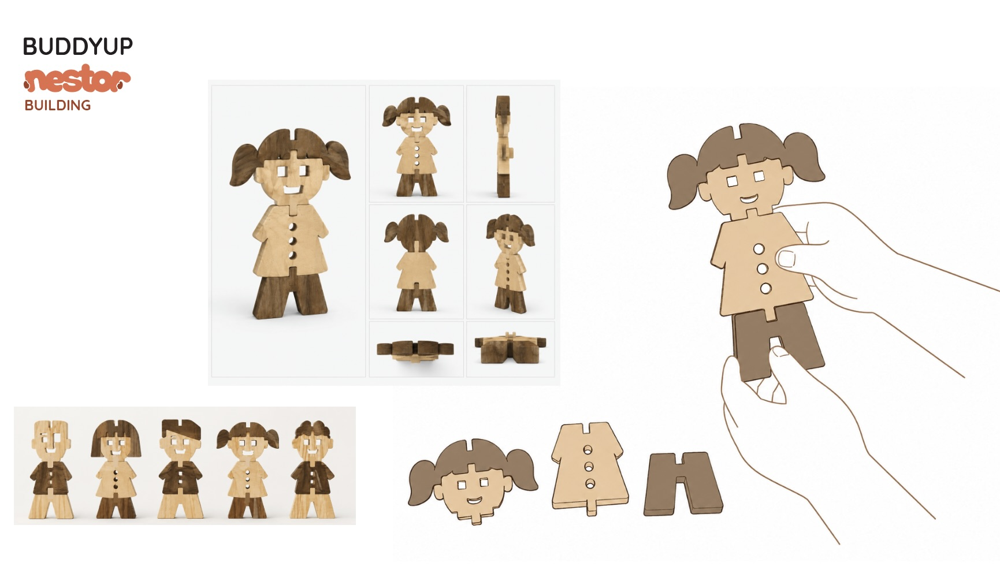
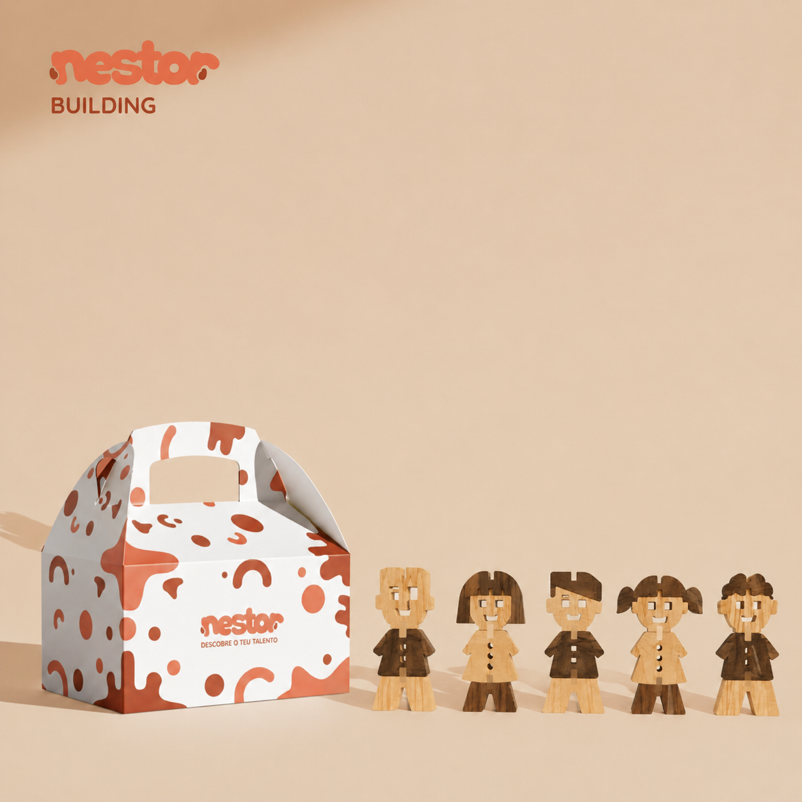
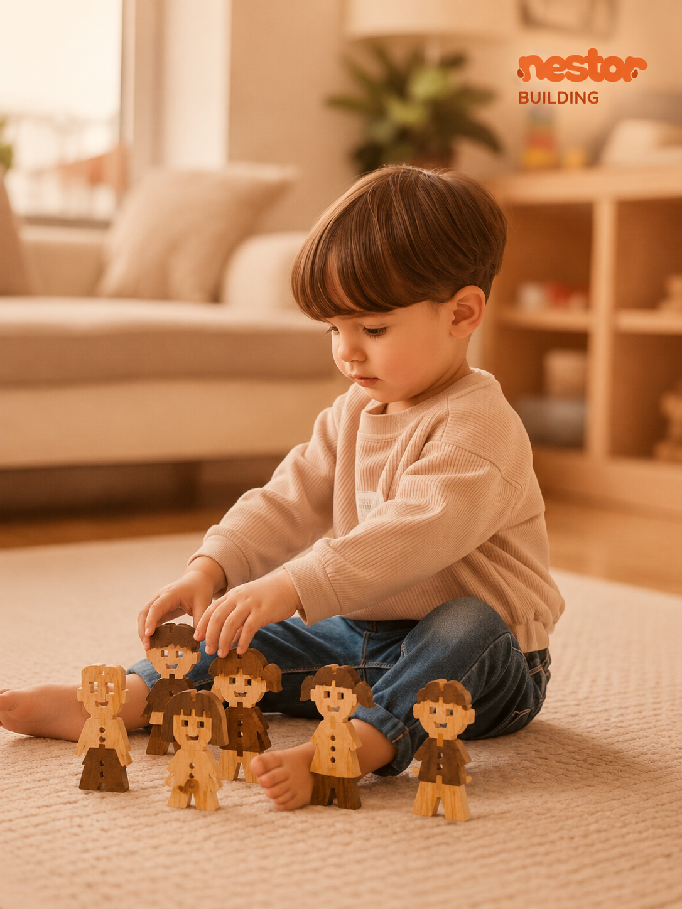
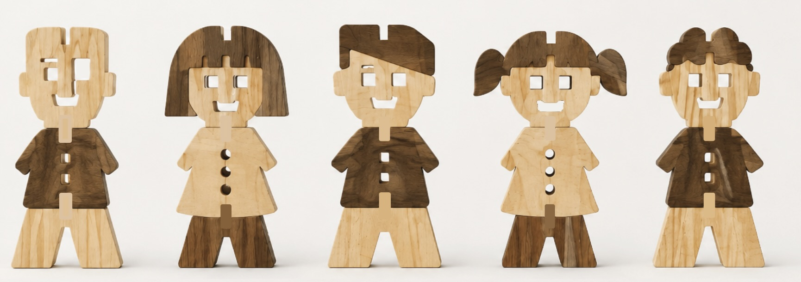

# BUDDYUP

<!--
  HERO: idealmente uma pseudo-sessão fotográfica do produto
  (ver tutorial Pletor.ai nos Recursos da disciplina, em
  /Recursos/AI_exps/). Usa attachments/hero.jpg para o frontmatter.
-->

> Constrói e cria as tuas personagens!

## Conceito

O produto faz parte da linha **NESTOR BUILDING** e consiste num brinquedo de construção e equilíbrio destinado a crianças dos **5 aos 12 anos**. O conceito baseia-se na construção de personagens através da combinação entre peças. A criança pode montar várias figuras combinando cabeças, troncos e pernas, estimulando a criatividade e a exploração de diferentes possibilidades.
Relativamente ao sistema de encaixe, as 5 personagens estão definidas com um encaixe simples entre as diferentes partes do boneco.
As peças interligam-se, permitindo uma montagem mais intuitiva e adequada ao público infantil.

## Enquadramento

O meu brinquedo pertence à mesma linha do brinquedo "Skyvila" na submarca NESTOR BUILDING, a cidade de construção, porque ambos partilham a mesma linguagem visual, a madeira de pinho e cerejeira e formas simples que estimulam a construção e a criatividade.
Para melhorar o projeto, acrescentaria mais um ou dois pontos de encaixe para aumentar a estabilidade das peças durante a montagem.

## Tecnologia

Materiais (espécie de madeira), processos de fabrico (CNC, laser, impressão 3D), software paramétrico, ficheiros técnicos.

- Modelo 3D: <!-- embed Fusion ou link a360.co -->
- Ficheiros: `attachments/`

## Função

## Como se brinca:

A criança seleciona as diferentes peças que compõem cada personagem e realiza a sua montagem através de um sistema simples de encaixe macho-fêmea. Cada figura é constituída por três componentes principais: cabeça, tronco e pernas.

A brincadeira consiste em combinar diferentes cabeças, troncos e pernas para criar personagens variadas, explorando diferentes identidades, profissões e habitantes da cidade. Após a montagem, as personagens podem ser utilizadas individualmente ou integradas nos restantes elementos da coleção Nestor Building, incentivando a criação de histórias, cenários urbanos e situações do quotidiano.

O sistema permite que a criança monte, desmonte e reorganize as peças livremente, promovendo a experimentação, a criatividade e o jogo simbólico

## Idade-alvo:

O brinquedo foi desenvolvido para crianças entre os 2 e os 5 anos de idade, fase em que ocorre um desenvolvimento significativo da coordenação motora fina, da perceção espacial e da capacidade de associação entre formas.

A simplicidade do sistema de encaixe permite uma utilização intuitiva e segura, adequada às capacidades motoras das crianças desta faixa etária. Simultaneamente, a possibilidade de criar diferentes personagens estimula a imaginação, a criatividade e o desenvolvimento de competências sociais através do jogo simbólico.

## Montagem:

A montagem foi concebida para ser simples, intuitiva e acessível às crianças.

O processo é realizado em três etapas:

1. Selecionar uma cabeça e encaixá-la na parte superior do tronco;
2. Escolher o tronco pretendido e unir a peça inferior através do encaixe central;
3. Verificar a estabilidade da personagem e iniciar a brincadeira.

Todos os encaixes foram dimensionados de acordo com a espessura da madeira utilizada, garantindo uma união segura entre as peças sem necessidade de ferramentas, colas ou elementos de fixação adicionais.

A desmontagem segue o mesmo princípio, permitindo que as peças sejam reorganizadas e reutilizadas em novas combinações.

## Conformidade com a Diretiva 2009/48/CE:

O brinquedo foi desenvolvido de acordo com os princípios estabelecidos pela Diretiva 2009/48/CE relativa à segurança dos brinquedos.

O projeto contempla:

- Utilização exclusiva de madeira natural adequada ao contacto com crianças;
- Ausência de materiais tóxicos, componentes eletrónicos ou elementos perigosos;
- Eliminação de arestas cortantes através do arredondamento dos contornos;
- Dimensões adequadas das peças para reduzir o risco de ingestão acidental;
- Sistema de encaixe simples e seguro, sem necessidade de ferramentas;
- Estrutura resistente às solicitações normais de utilização;
- Identificação clara da faixa etária recomendada e do modo de utilização.

Estas características garantem que o brinquedo oferece condições adequadas de segurança, durabilidade e conforto durante a utilização infantil.

## Objetivos Pedagógicos:

O brinquedo promove o desenvolvimento da coordenação motora fina através da manipulação e encaixe das peças. Simultaneamente, estimula a perceção visual, o reconhecimento de formas e a compreensão das relações espaciais.

A possibilidade de criar diferentes personagens incentiva a criatividade, a imaginação e o jogo simbólico, permitindo que a criança construa narrativas próprias e explore diferentes papéis sociais presentes no contexto urbano representado pelo universo Nestor Building.

## Sistema Construtivo:

O brinquedo utiliza um sistema de encaixe macho-fêmea (press-fit), composto por linguetas e ranhuras dimensionadas de acordo com a espessura do material. Esta solução permite a montagem e desmontagem repetida das peças sem recurso a colas, parafusos ou outros elementos de fixação, simplificando a produção, aumentando a durabilidade do produto e facilitando a utilização por crianças de tenra idade.

## Apresentação

Imagens-chave que sintetizam o produto final.
Foram utilizadas imagens geradas por inteligência artificial para as duas primeiras fotografias, enquanto as restantes correspondem a renders produzidos também por IA de desenhos meus feitos no Ilustrator. A renderização foi inacabada.

---

## Processo

O percurso completo de iterações, modelos e pesquisa está em [processo.md](processo.md), organizado do **mais recente** para o **mais antigo**.

[Ver processo completo →](processo.md)
