# Processo

> Organizado do **mais recente** para o **mais antigo**. Faz uma seleção que torne clara, aprazível e detalhada a evolução do produto e das ideias.

## 1. Modelos 3D

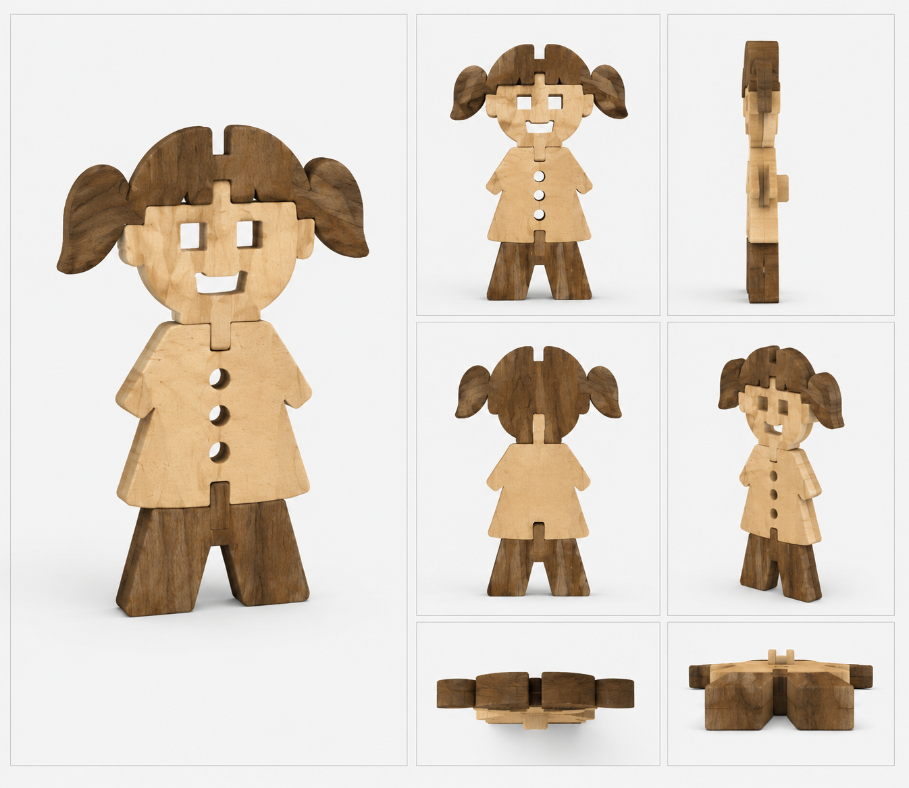

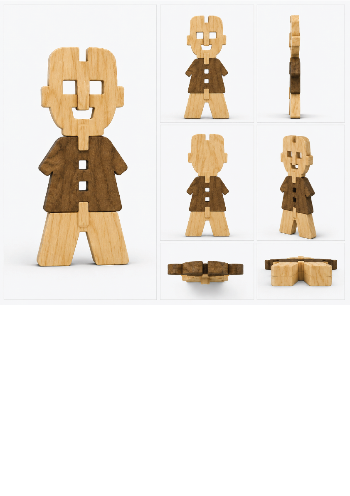
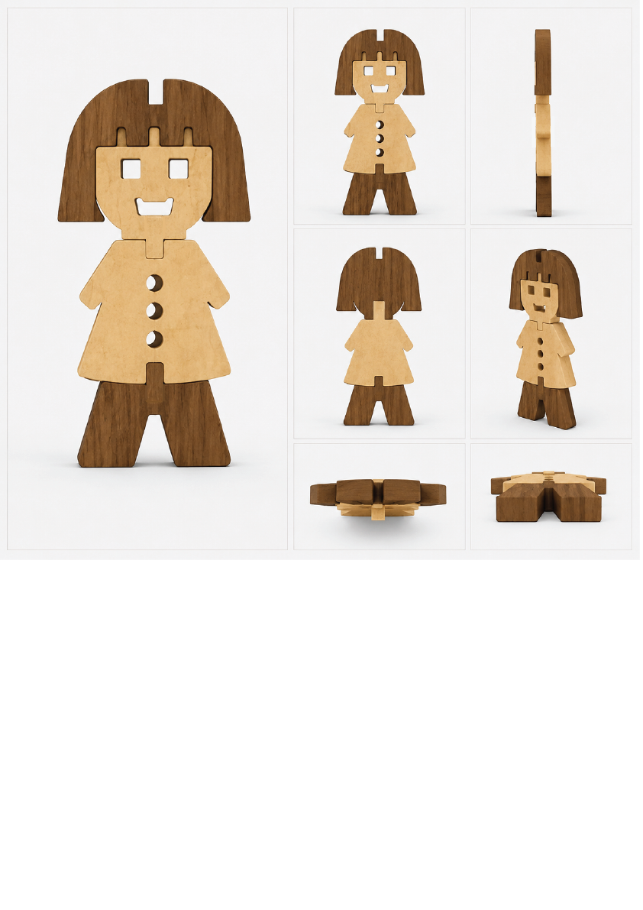

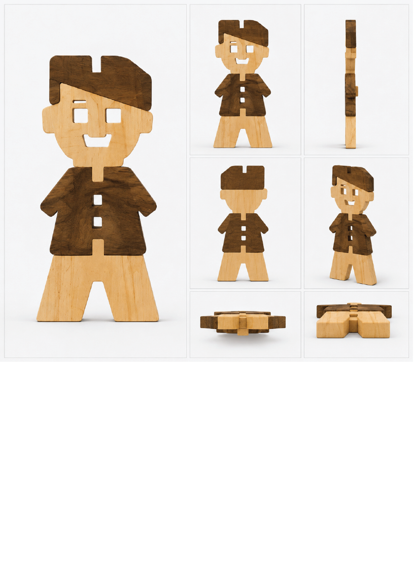
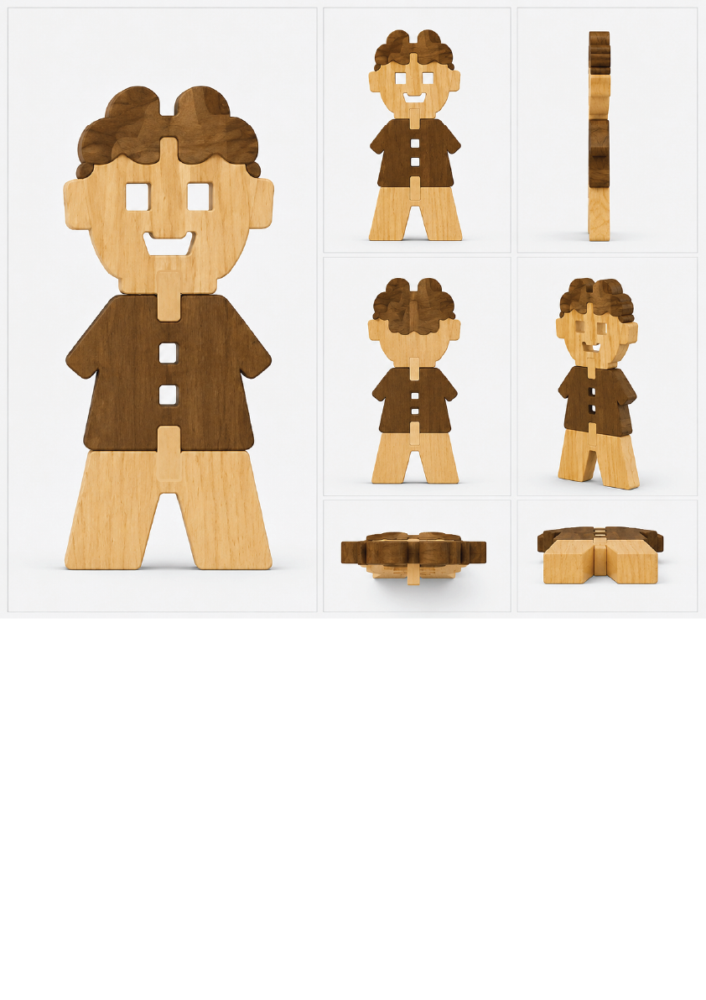
## Esboços e Prancha-resumo

Esta secção reúne os esboços iniciais e as pranchas-resumo que documentam a evolução do projeto ao longo das diferentes fases de desenvolvimento.

Prancha-resumo renderizada- Última Fase

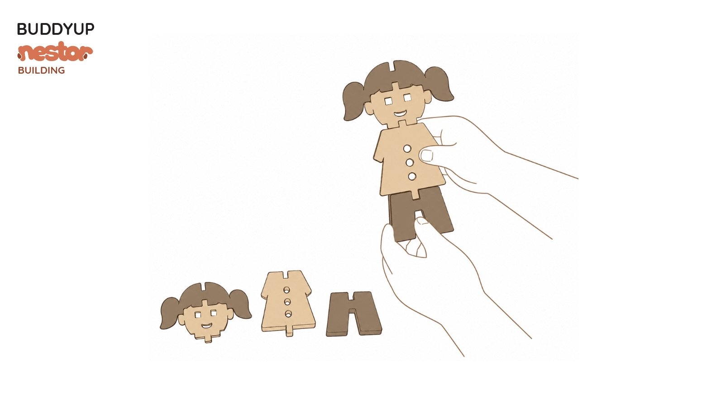
Prancha-resumo 3 - Terceira fase

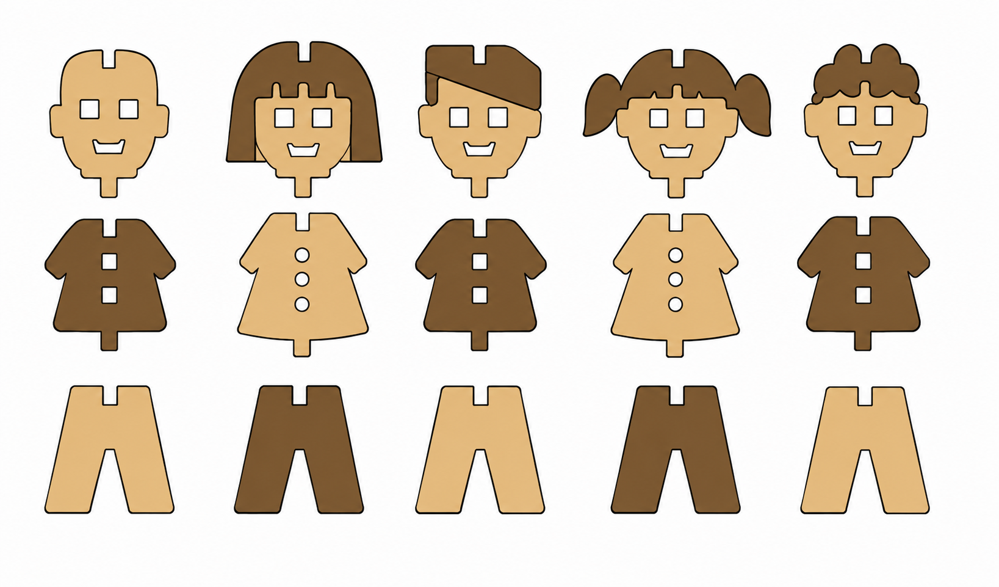
Esboço 6 - Exploração da arquitetura das peças 

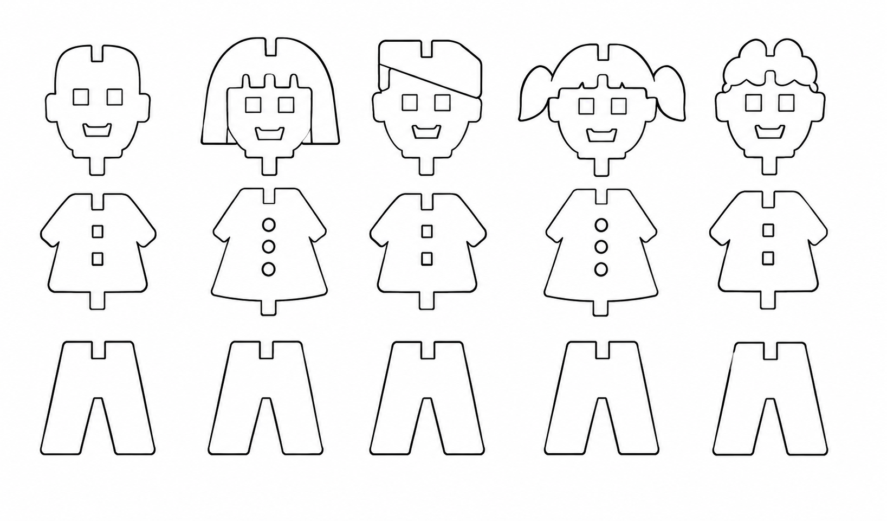
Esboço 5 - Desenho digital - tipologia e arquitetura das peças

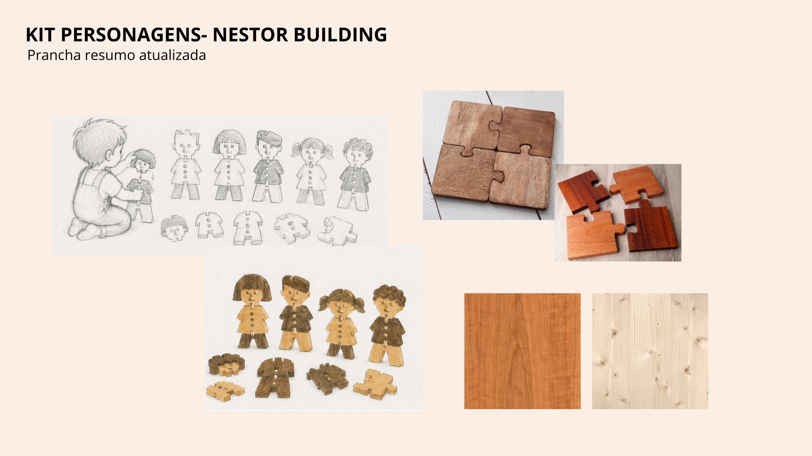
Prancha-resumo 2 - Segunda fase

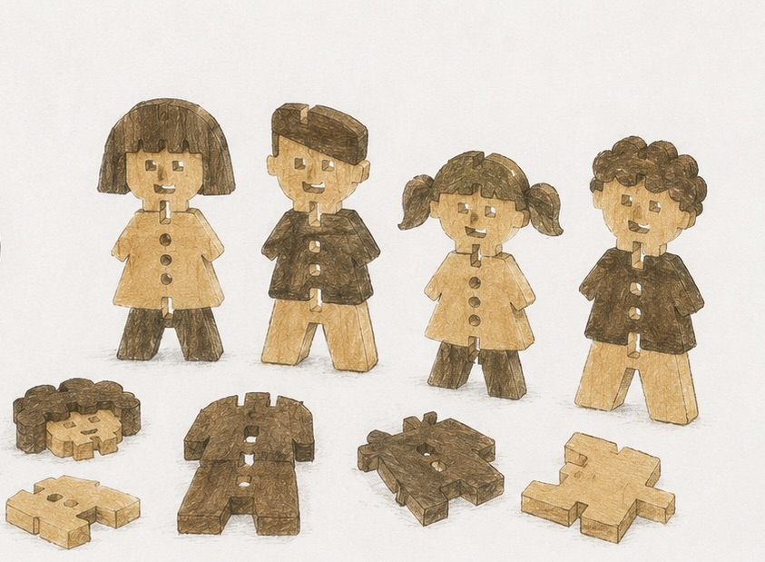
Esboço 4- Exploração da arquitetura das peças 

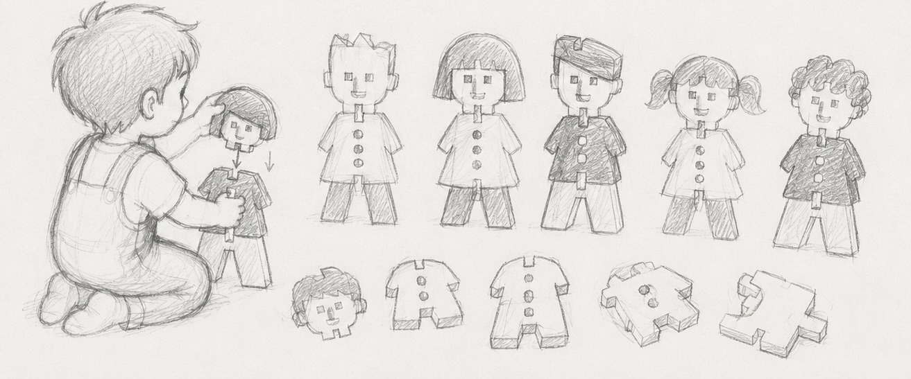
Esboço 3 - exploração de novas formas para as peças

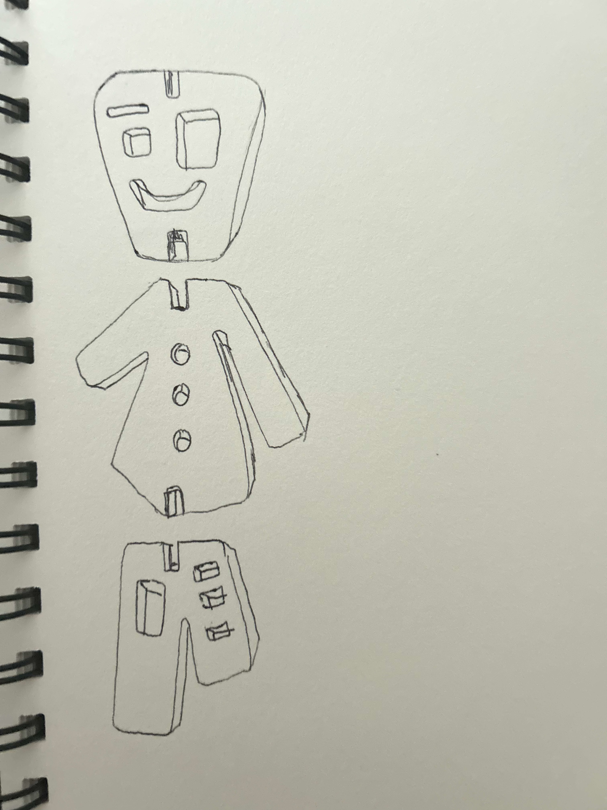
Esboço 2 - formato das peças, curavturas e encaixes

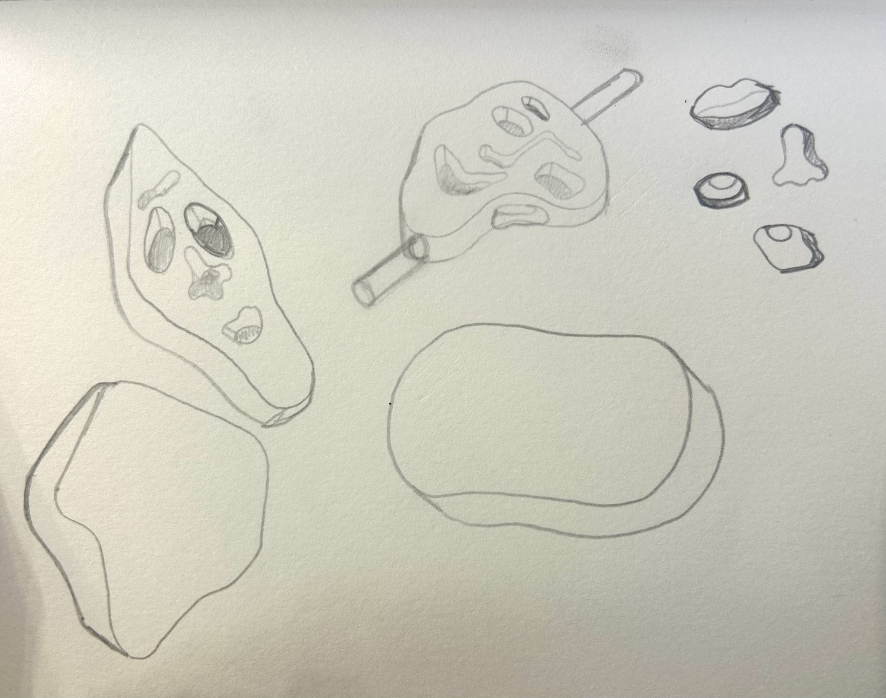
Esboço 1 - formato e desenho das peças

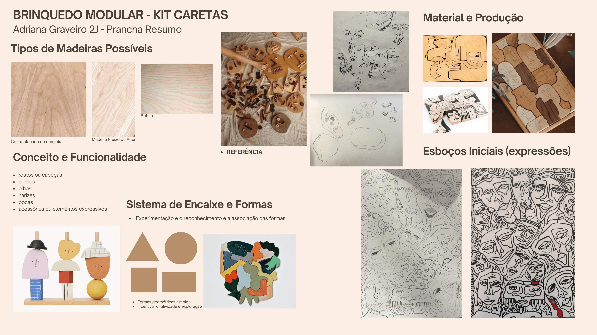
Prancha-resumo 1 - Primeira Fase

## 7. Pesquisa

### 7.1. Aspectos valorizados do moodboard, desconstrução da forma (o que distingue o programa formal)

O moodboard reúne referências de brinquedos em madeira que exploram a construção modular, os encaixes e a interação livre da criança com o objeto. As imagens selecionadas evidenciam sistemas de montagem simples e intuitivos, inspirados na lógica dos puzzles, permitindo estimular a coordenação motora, a perceção espacial e a criatividade.

A escolha das madeiras de **pinho** e **cerejeira** surge da necessidade de criar contraste visual sem recorrer à utilização de cores, valorizando as características naturais dos materiais. O pinho apresenta uma tonalidade clara e suave, enquanto a cerejeira oferece um tom mais escuro e quente, permitindo diferenciar elementos do brinquedo de forma natural.

Estas referências serviram de base para o desenvolvimento do **Projeto Nestor**, nomeadamente na criação de personagens construídas através de encaixes simples, seguros e intuitivos, garantindo simultaneamente a estabilidade e o equilíbrio das figuras durante a brincadeira.

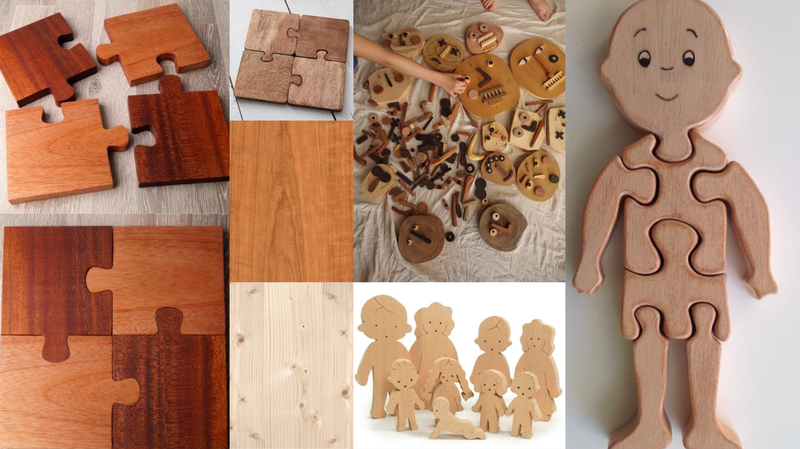

A utilização de encaixes inspirados nos puzzles, aliada ao contraste entre pinho e cerejeira, resulta num objeto acessível para crianças com menos de três anos, promovendo a exploração, a criatividade e o desenvolvimento cognitivo, enquanto mantém uma linguagem estética intemporal capaz de continuar a despertar interesse ao longo do tempo.
### Sustentabilidade e Aproveitamento da Matéria-Prima

Outro aspeto fundamental do projeto consiste na otimização do material utilizado. Todas as peças foram concebidas para ocupar o máximo espaço possível da placa de madeira, reduzindo significativamente os desperdícios durante o processo de produção.

Esta estratégia permite um aproveitamento eficiente da matéria-prima, reforçando os princípios de sustentabilidade associados ao projeto e valorizando cada elemento retirado da chapa de madeira.

