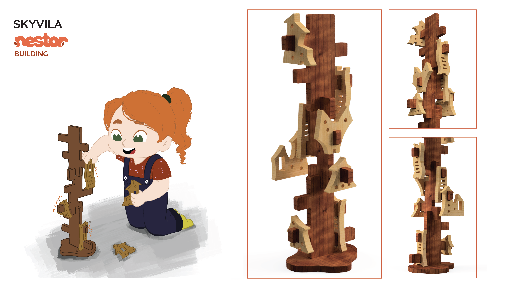
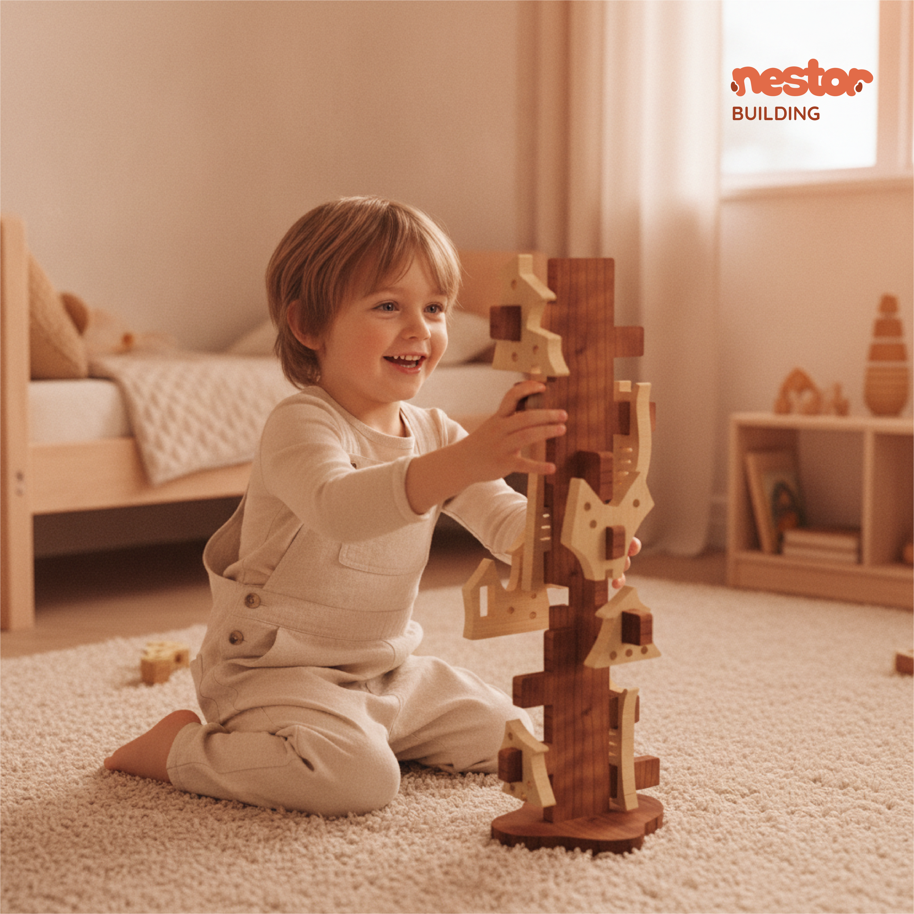
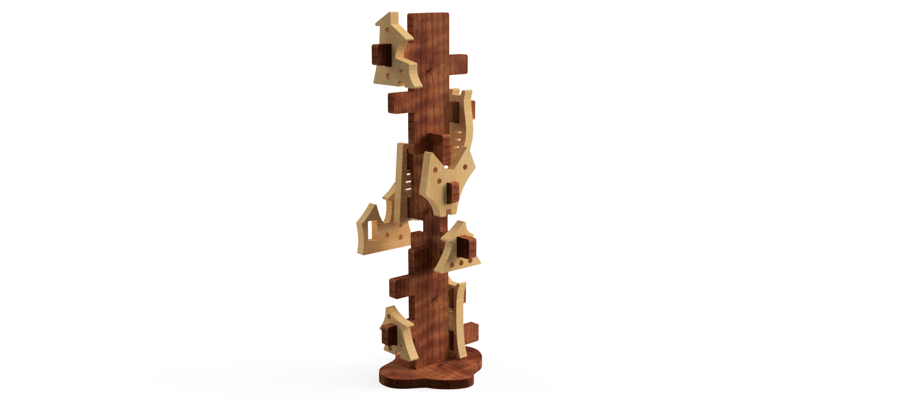
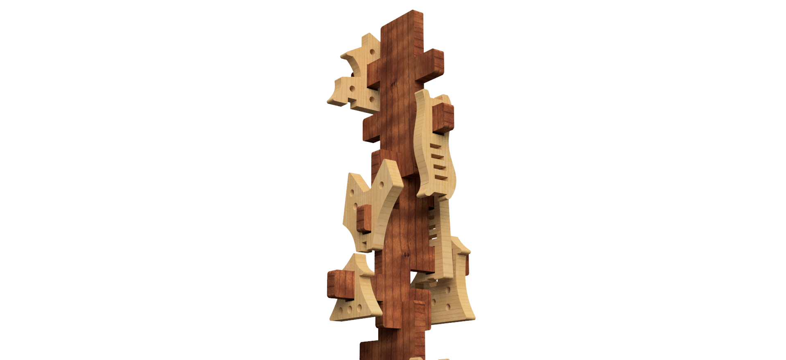
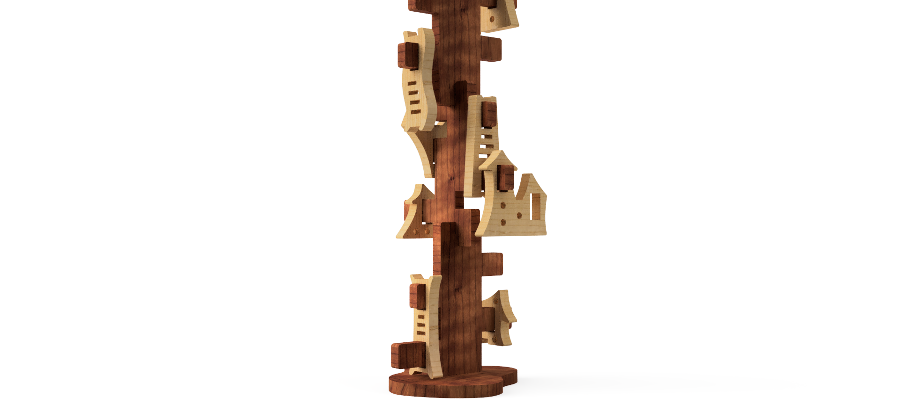

# Skyvila

<!--
  HERO: idealmente uma pseudo-sessão fotográfica do produto
  (ver tutorial Pletor.ai nos Recursos da disciplina, em
  /Recursos/AI_exps/). Usa attachments/hero.jpg para o frontmatter.
-->

> Equilibra, constrói e não deixes cair.

## Conceito

O produto faz parte da linha **NESTOR BUILDING** e consiste num brinquedo de construção e equilíbrio destinado a crianças dos **5 aos 12 anos**, com o objetivo de estimular a criatividade, a coordenação motora e o pensamento espacial. A estrutura é composta por três troncos de árvore, cuja dificuldade aumenta conforme o número de troncos empilhados. A criança deve equilibrar as peças da “cidade” nos ramos, evitando que caiam ou que a árvore perca estabilidade. O brinquedo promove a experimentação, a descoberta de soluções e a exploração de múltiplas possibilidades de montagem.

## Enquadramento

O brinquedo posiciona-se no contexto do grupo através da partilha de uma linguagem comum baseada na simplicidade formal, no uso da madeira e na valorização de objetos que estimulam interação e criatividade. A recolha inicial de objetos a redesenhar permitiu identificar elementos recorrentes, como sistemas de encaixe, modularidade e formas geométricas básicas, que serviram de referência para o desenvolvimento do projeto. A partir dessas observações, o brinquedo foi reinterpretado de forma a manter coerência com a identidade definida pelo grupo, integrando materiais naturais e soluções construtivas que refletem os princípios estabelecidos na fase de análise.

## Tecnologia

O brinquedo é produzido em madeira de pinho e cerejeira, selecionadas pela sua resistência, estabilidade, leveza, textura e carácter natural, mantendo a identidade material da marca. As peças foram fabricadas a partir de uma placa de 12 mm de espessura, processada por uma maquina CNC com uma fresa de 3 mm, permitindo cortes limpos, precisão nos encaixes ao longo da produção. 

O desenvolvimento técnico foi realizado no Autodesk Fusion 360, onde o modelo foi construído de forma paramétrica, possibilitanto o ajuste de espessuras e geometrias de acordo com a necessidade de fabrico. A disposição das peças no plano de corte foi otimizada no Fusion 360, garantindo um bom aproveitamento da madeira e reduzindo o desperdício.

- Modelo 3D: https://a360.co/4cS26xF <!-- embed Fusion ou link a360.co -->

## Função

**Como se brinca**
A criança seleciona quantos troncos pretende utilizar, 1 tronco (nível fácil), 2 troncos (nível intermédio) ou 3 troncos (nível difícil) e, encaixa-os na base. Em seguida, escolhe as peças da “cidade” e distribui-as pelos ramos, tentando manter o equilíbrio da estrutura. O desafio consiste em posicionar cada peça de forma estratégica, evitando que a árvore tombe ou que as peças caiam. O jogo termina quando a árvore se mantém estável com todas as peças colocadas ou quando a estrutura perde equilíbrio, incentivando a tentativa, o erro e a reconstrução.

**Idade-alvo**
O brinquedo é adequado para crianças dos 6 aos 12 anos, faixa etária que apresenta uma coordenação motora mais desenvolvida, capacidade de resolução de problemas e interesse por desafios estruturais e atividades de construção.

**Montagem**
A montagem é simples e intuitiva, permitindo autonomia total da criança: encaixar o tronco na base; selecionar o nível de dificuldade; distribuir as peças pelos ramos; ajustar posições para manter o equilíbrio; Não requer ferramentas nem instruções complexas.

**Conformidade com a diretiva 2009/48/CE** 
O brinquedo cumpre os requisitos da Diretiva 2009/48/CE relativa à segurança dos brinquedos, garantindo: utilização de materiais seguros e não tóxicos; ausência de arestas cortantes ou elementos perigosos; dimensões adequadas para evitar risco de ingestão; estabilidade estrutural e resistência mecânica; indicação clara da idade recomendada e modo de utilização;
Esta conformidade assegura que o produto pode ser utilizado de forma segura tanto em contexto doméstico como educativo.

## Apresentação

Imagens-chave que sintetizam o produto final.
Foram utilizadas imagens geradas no Pletor.ai para as duas primeiras fotografias, enquanto as restantes correspondem a renders produzidos no Fusion 360.

---

## Processo

O percurso completo de iterações, modelos e pesquisa está em [processo.md](processo.md), organizado do **mais recente** para o **mais antigo**.

[Ver processo completo →](processo.md)
